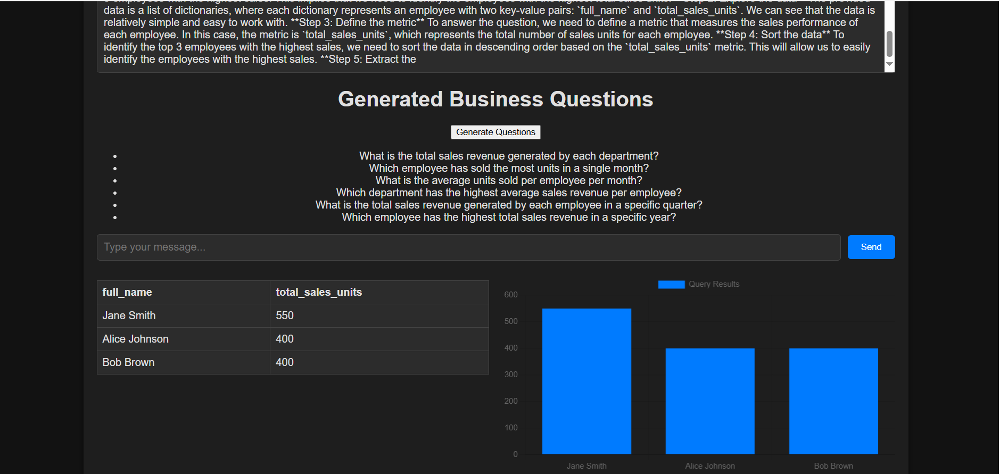

# Chatbot System with FastAPI, Groq LLM, Redis, MySQL, ChromaDB, Nginx, Docker, and Kubernetes

This project is a scalable chatbot system built using modern technologies:

- **FastAPI**: Backend server for handling HTTP requests.
- **Groq LLM**: For generating intelligent chatbot responses.
- **Redis**: For caching frequent responses and session management.
- **MySQL**: For storing user data and conversation history.
- **ChromaDB**: For vector storage and retrieval (e.g., semantic search).
- **Nginx**: As a reverse proxy for load balancing and SSL termination.
- **Docker**: For containerizing the application.
- **Kubernetes**: For orchestration and scaling.




## Table of Contents

- [Features](#features)
- [Prerequisites](#prerequisites)
- [Setup and Installation](#setup-and-installation)
- [Running the Application](#running-the-application)
- [Deploying with Kubernetes](#deploying-with-kubernetes)
- [API Endpoints](#api-endpoints)
- [Project Structure](#project-structure)
- [Contributing](#contributing)
- [License](#license)

## Features

- **FastAPI Backend**: High-performance API for handling chatbot requests.
- **Groq LLM Integration**: Generates intelligent and context-aware responses.
- **Redis Caching**: Caches frequent responses to reduce latency.
- **MySQL Database**: Stores user data and conversation history.
- **ChromaDB Vector Storage**: Enables semantic search and context management.
- **Dockerized**: Easy to deploy and scale using Docker containers.
- **Kubernetes Deployment**: Orchestrates and manages containers in production.
- **Nginx Reverse Proxy**: Provides load balancing and SSL termination.

## Prerequisites

Before you begin, ensure you have the following installed:

- **Docker**: Install [Docker](https://www.docker.com/get-started)
- **Docker Compose**: Install [Docker Compose](https://docs.docker.com/compose/install/)
- **Kubernetes**: Install [Kubernetes](https://kubernetes.io/docs/setup/)
- **Python 3.9+**: Install [Python](https://www.python.org/downloads/)
- **Groq API Key**: Sign up at [Groq](https://groq.com/) to get your API key.
- **MySQL**: Install MySQL or use a Docker container.
- **Redis**: Install Redis or use a Docker container.

## Setup and Installation

### Clone the Repository:

```bash
git clone https://github.com/your-username/chatbot-system.git
cd chatbot-system
```

### Set Up Environment Variables:

Create a `.env` file in the root directory and add the following:

```env
GROQ_API_KEY=your_groq_api_key
MYSQL_HOST=mysql
MYSQL_USER=user
MYSQL_PASSWORD=password
MYSQL_DATABASE=chatbot_db
REDIS_HOST=redis
REDIS_PORT=6379
```

### Install Python Dependencies:

```bash
pip install -r requirements.txt
```

### Build and Run with Docker Compose:

```bash
docker-compose up --build
```

## Running the Application

### Start the Application:

After running `docker-compose up --build`, the application will be available at:

```
http://localhost:8000
```

### Test the API:

Use the `/chat` endpoint to interact with the chatbot:

```bash
curl -X POST "http://localhost:8000/chat" -H "Content-Type: application/json" -d '{"user_id": "123", "message": "Hello, how are you?"}'
```

## Deploying with Kubernetes

### Build and Push Docker Image:

```bash
docker build -t your-dockerhub-username/chatbot:latest .
docker push your-dockerhub-username/chatbot:latest
```

### Deploy to Kubernetes:

Apply the Kubernetes configurations:

```bash
kubectl apply -f kubernetes/
kubectl apply -f kubernetes/monitoring.yaml
- Access Grafana at http://<your-cluster-ip>:3000
kubectl apply -f kubernetes/logging.yaml
- Access Loki UI at http://<your-cluster-ip>:3100
kubectl apply -f kubernetes/redis-deployment.yaml
kubectl apply -f kubernetes/celery-deployment.yaml

kubectl apply -f kubernetes/mysql-shard-1.yaml
kubectl apply -f kubernetes/mysql-shard-2.yaml


```

### Access the Application:

The application will be accessible via the Kubernetes service. Use the external IP provided by your cloud provider or Minikube.

## API Endpoints

### `POST /chat`

Send a message to the chatbot and get a response.

#### Request Body:

```json
{
  "user_id": "123",
  "message": "Hello, how are you?"
}
```

#### Response:

```json
{
  "response": "I'm doing well, thank you! How can I assist you today?"
}
```

## Project Structure

```
chatbot-system/
├── .github/workflow/
│           ├── deploy.yml  
├── backend/
│   ├── __init__.py
│   ├── app.py               # FastAPI application
│   ├── main.py              # Functions 
│   ├── models.py            # Database models
│   ├── schemas.py           # Pydantic schemas
│   ├── crud.py              # Database operations
│   ├── users.py             # For register and login users
│   ├── llm.py               # Groq LLM integration
│   ├── cache.py             # Redis integration
│   ├── vector_db.py         # ChromaDB integration
├── frontend/                # frontend to ask queries and visualize charts and tables for users
│   ├── index.html
├── docker-compose.yml       # Docker Compose for local development
├── Dockerfile               # Dockerfile for FastAPI app
├── kubernetes/              # Kubernetes deployment files
│   ├── chatbot-deployment.yaml
│   ├── nginx-deployment.yaml
│   ├── service.yaml
│   ├── nginx-config.yaml
├── requirements.txt         # Python dependencies
├── README.md                # Project documentation
├── .env

```

## Monitoring
Step 1: Add Prometheus as a Data Source in Grafana
Open Grafana at http://<your-cluster-ip>:3000
Go to Configuration → Data Sources
Click "Add Data Source" → Select Prometheus
Set URL to http://prometheus:9090
Click Save & Test

Step 2: Import Pre-Built Grafana Dashboard
Go to Dashboards → Import
Enter Dashboard ID 11074 (FastAPI Performance Dashboard)
Click Load and set Prometheus as the data source
Click Import


Step 3: Add Loki for Log Visualization
Go to Configuration → Data Sources
Click "Add Data Source" → Select Loki
Set URL to http://loki:3100
Click Save & Test
Create a new panel → Choose Loki Query
Use query:
logql
Copy
Edit
{job="fastapi"}
Save your dashboard 


Step 4: Verify Logs
Run a test API request:

sh
Copy
Edit
curl http://<your-cluster-ip>:8000/


Step 5: Test Asynchronous Task
Start an async task:

sh
Copy
Edit
curl -X POST "http://<your-cluster-ip>:8000/process/?x=5&y=10"
Get task status:

sh
Copy
Edit
curl "http://<your-cluster-ip>:8000/task/{task_id}"


Run API call:

sh
Copy
Edit
curl http://<your-cluster-ip>:8000/user/123


## queries:
- Who sold the most units?
- Who are the top 3 employees with the highest sales?
- How many units did each employee sell in January 2021?
- What is the total number of units sold for each employee, sorted from highest to lowest?

- "Show me all employees and their departments."
- "List all sales transactions."
- "What is the total sales per department?"
- "Show sales records after January 2021."
- "Which employees have made at least one sale?"
- "Which employees have not made any sales?"
- "How many units did each employee sell in January 2021?"


